# Aprofundamento em sistemas cyberfísicos

Nesta atividade, iremos explorar aspectos de controle de sistemas dinâmicos, implementação realista de controle PID e a solução do exercício proposto na aula 3.

Nesse texto, os tópicos são introduzidos de maniera breve e direta sendo recomendado ao leitor ou leitora uma leitura mais aprofundada na referência: Controle Automático (Castrucci) -  2 Edição.

## 1. Introdução ao controle de sistemas dinâmicos
### 1.1 O significado de controlar e nomeclatura

A ideia de controle automático é muito antiga, mas popularmente considera-se o regulador de Watt como sendo o primeiro controlador automático da humanidade.

A ideia de controlar consiste em condicionar uma variável de interesse a um valor especificado. Por exemplo, manter o nível de uma piscina em 2.5m de altura ou comandar um drone para que saia de um ponto origem **A** e chege a um ponto destino **B**.

Os primeiros controles, antes do regulador de Watt implementavam ''sistema de malha aberta'' em que para controlar a temperatura de um forno, uma embalagem de Lasanha recomenda que se pré-aqueça um forno por 15 min sem que se meça a temperatura do forno para se saber se de fato a temperatura encontra-se no patamar desejado.

Depois, surgiram os controladores em ''malha fechada'' em que uma medida daquilo que se desejava controlar era repassada para um controlador realizar um esforço de controle com base no erro entre o valor desejado e o valor medido da variável que se deseja controlar. Um exemplo clássico desse sistema é quando alguém deseja tomar um banho quente, mas a água está muito fria e percebendo o erro entre a temperatura desejada da água e a temperatura gélida daquele instante a pessoa fecha um pouco o registro para que a diminuição da vazão implique em uma água mais quente para o banho.

Essa ideia de realimentação do sinal medido, comparação com uma referência que resultasse num erro que por sua vez resultasse numa ação de controle deu origem ao que se chama de ''Malha de controle'' que será mostrada a seguir.

### 1.2 Malha de Controle de sistemas SISO

 1a)
 1b)
 1c)

fonte das imagens: [PUC-RIO](https://www.maxwell.vrac.puc-rio.br/24097/elementos.html)

Na figura 1a) observa-se um esquema de controle do nível de um reservatório de água. Existe um Suprimento de água que é controlado por uma vávula de controle. Quando falta água, a válvula se abre permitindo repor a água para manter um nível desejado no reservatório. O nível desejado é medido por um sensor de nível que fornece essa informação a um controlador de nível que por sua vez regula a válvula.

Na figura 1b) O mesmo se observa, mas os elementos físicos são abstratídos em um **diagrama de blocos** que por sua vez chega em seu nível de abstração máxima quando retratado por funções de transferência **C(s)** representando o controlador, **G(s)** representando a dinâmica da planta (reservatório) e **L(s)** representando a dinâmica do sensor de nível. E com sinais no domínio de laplace **R(s)** sendo a referência de nível desejada, **E(s)** o erro entre o nível desejado e o nível atual (note que é realizada uma operação de comparação entre R(s) e o sinal que sai de L(s) comumente denominado B(s)), e **Y(s)** sendo o sinal medido que se deseja controlar. O sinal que sai do bloco C(s) e direciona-se a controlar o bloco G(s) é comumente denominado U(s) e é chamado esforço de controle.

Dado essa maneira de pensar um controlador, o algorítimo de controle **C(s)**  mais utilizados em sistemas SISO *Single Input - Single Output* é o PID *Proporcional Integral e Derivaitivo* que funciona por meio das operações de proporcionalidade, integral e derivada do erro entre o que se tem de referência para uma dada variável e seu valor real em um determinado instante. A seguir, explora-se as características e implementações desse algorítimo.

## 2. O controle PID

A ideia do controle PID é gerar um esforço de controle u(t) a partir de operações sobre erro e(t) ambos mostrados na ''Malha de Controle''.

A expressão linear idelaizada desse algorítimo é exposta a seguir

$u(t) = K_p \times ( e(t) + \cfrac{1}{T_i} \int_{0}^{t} e(\tau) d\tau + T_D \cfrac{de(t)}{dt})$

ou

$u(t) = u_P(t) + u_I(t) + u_D(t)$

O que no domínio de Laplace se escreve como

$\cfrac{U(s)}{E(s)} = K_p \times ( 1 + \cfrac{1}{s \times T_i} + T_D \times s)$

Um aspecto interessante que se deve ter em conta é que muitas vezes um ajuste suficientemente bom de um controlador PID pode ser conseguido, a depender do contexto, com versões simplificadas desse algorítimo, ou seja, utilizando-se somente o controle P ou PI ou PD. A ausência de uma das letras da sigla PID significa que a parcela ausente não influencia no esforço de controle u(t). 

### 2.1 Proporcional

Essa parcela é intuitiva, quanto maior o erro entre o valor de referência e o valor atual de uma variável, maior deverá ser o eforço de controle u(t) para que o erro e(t) seja minimizado. Por exemplo, se a água do chuveiro estiver muito gelada, então se deve fechar bastante o registro para que ela saia quente. Por outro lado, caso a água já esteja morna, um leve ajuste no registro será suficiente. Matemáticamente:

$u_P(t) = K_p \times e(t)$

#### Parâmetro K_p
Esse parâmetro indica a agressividade do controle. Ele determina o quão intenso será o esforço de controle u(t) para um determinado valor de erro e(t).

Fazendo-se uma análise mais avançada do lugar das raízes (LGR) pode-se notar que há casos em que o aumento do $K_p$ implica no estabilização de um sistema e que no caso de sistemas de fase não mínima, é comum que o aumento do ganho $K_p$ além de um valor crítico desestabilize o sistema a ser controlado.

E sempre aumentar o $K_p$ resulta num sistema que rastreia uma referência mais rapidamente pois aumenta a intensidade do esforço de controle.

### 2.2 Integral

Essa parcela é muitas vezes introduzida no controle com os seguintes objetivos
* Aumentar o tipo do sistema, o que implica no rastreamento com erro nulo a trajetórias de grau mais elevado
* Acelerar a dinâmica do controle, isto é, diminuir o tempo nescessário para chegar ao regime permanente no valor de referência desejado

A parcela responsável por fazer isso é

$u_I(t) = K_p \times \cfrac{1}{T_i} \int_{0}^{t} e(\tau) d\tau$

E como se vê o erro é integrado de tal maneira que o esforço de controle aumenta se mais tempo passa sem que o erro seja diminuido. Essa parcela do controle aumenta a velocidade do rastreamento da referência pois penaliza o controle caso ele demore muito para atingir o objetivo por meio do aumento do esforço de controle.

Quanto ao tipo do sistema, intuitivamente pode-se imaginar o caso em que se deseje manter um drone a 1m de altura. Caso um controle proporcional controlasse o empuxo nas hélices desse drone, no momento em que o objetivo fosse alcançado o erro seria nulo e proporcionalmente o empuxo também seria nulo resultando na queda do drone. Mas, se houver um valor integrado (acumulado) de erro por meio de uma parcela integrativa do erro, então o esforço de controle com erro nulo seria $u(t) \neq 0$ de tal maneira que haveria empuxo o suficiente para que o drone chegasse na cota 1m e se mantesse nela. Ou seja, a parcela integral aumenta o típo do sistema pois permite rastrear uma referência que seria impossível de se rastrear somente com controle proporcional.

Essa ideia de integração é utilizada em inumeras outras técnicas de controle além do PID.

É importante salientar contudo que o como se vê na figura, a integração de um erro cosntante resulta em $u_I(t) -> \infty$ quando $t -> \infty$ o que certamente é impraticável dado que atuadores reais não possuem esforço de controle infinito. Esse problema é chamando windup. Por exemplo, um pistão não consegue impor força infinita sobre um gás numa bomba de encher bicicletas. Logo, não é possível implementar na prática essa versão do integrador linear. Uma versão mais realista será discutida a seguir.

#### Parâmetro T_i

O significado desse parâmetro é que T_i é o tempo nescesário para que, mantido o erro e(t) constante, a integral do erro resulte nesse patamar de erro, isto é:

$e(T_i) = \int_{0}^{T_i} e(\tau) d(\tau)$

A figura a seguir ilustra graficamente o significado dessa equação


Fonte: [Apostila de Controle - Escola Politécnica da Universidade de São Paulo](https://edisciplinas.usp.br/mod/resource/view.php?id=123526)

### 2.3 Derivativo


Essa parcela é muitas vezes introduzida no controle com os seguintes objetivos
* Aumentar a estabilidade do controle
* Permitir ganhos integrativos e proporcionais maiores, o que implica em um controle mais rápido
* Reduzir sobressinal
* Carater preditivo

A parcela responsável por fazer isso é

$u_D(t) = K_p \times  T_D \cfrac{de(t)}{dt}$

A parcela derivativa está associada a um aumento da estabilidade do sistema por ser um efeito oposto ao integrador. Porém, a parecela derivativa nunca é adicionada da maneira exposta acima pois dessa maneira ela representa um sistema não causal, dado que sua resposta depende de um valor futuro do erro. E ainda, a derivada potencializa o efeito de ruídos de alta frequência dado que a derivada em laplace é um filtro que introduz ganho em altas frequências. Ou seja, um derivador puro pode levar um ruído de ganho baixo para uma saída de amplitude infinita quebrando assim a estabilidade BIBO *Bounded Input - Bounded Output*.

Por outro lado, considerando-se o carater preditivo visto na figura a seguir, a parecela derivativa permite antever o que ocorrerá no futuro próximo permitindo assim que os ganhos proporcional $K_p$ e integral $T_i$ sejam mais agressivos pois quando o erro tende a zero, a parecela derivativa é capaz de antever esse momento e já compensar os efeitos de ganhos proporcional e integrativo mais elevados do que deveriam ser se somente controle PI. Por esse motivo, a parcela derivativa é capaz de reduzir sobressinal.

Note que para sistemas assintoticamente estáveis a parcela derivativa introduz um esforço de controle $u_D < 0$ pois o erro está sempre diminuindo de tal maneira que a derivada do erro é sempre negativa. A ação derivativa atua como um "freio preditivo" do controle.

#### Parâmetro T_D

O significado desse parâmetro é que T_D é o tempo de horizonte de predição. Matematicamente realiza-se a seguinte aproximação

$e(t+T_D) \approx e(t) + T_D\cfrac{de(t)}{dt}$

em que se T_D é escolhido muito grande, o controle prevê instantes bastante avançados no tempo, mas com baixa precisão. E caso contrário, isto é, com T_D não muito grande, a precisão da previsão aumenta apesar de ser menos avançada no tempo. $T_D = 0$ anula o caráter derivativo do PID tornando-se um controle PI. 

A figura a seguir ilustra graficamente o significado dessa equação


Fonte: [Apostila de Controle - Escola Politécnica da Universidade de São Paulo](https://edisciplinas.usp.br/mod/resource/view.php?id=123526)

## 3. Implementação realista do controle PID
### 3.1 Anti-windup

O windup ocorre pois controladores mandam um sinal chamado esforço de controle u(t) para um atuador que atua sobre uma planta G(s). E esses atuadores possuem um limite de esforço de controle máximo que são capazes de empregar. Por exemplo, um par motor-hélice consegue prover um empuxo máximo limitado pela rotação máxima do motor escolhido e pelo design da hélice.

Existem duas soluções para esse problema

#### 3.1.1 Limitar integrador

Adiciona-se uma condicional que zera o a parcela a ser integrada no instante t caso isso implique em um esforço de controle u(t) maior do que aquele realizável pelo atuador.

#### 3.1.2 Subtrair excedente

Uma outra maneira é permitir a integração mesmo quando o esforço de controle do atuador é saturado por suas limitações físicas, mas adicionando uma parcela subtrativa que compensa a soma excedente. Nesse caso, existe uma forma apropriada de se fazer isso onde uma parâmetro extra chamado $T_t = \sqrt{T_D * T_i}$ é adicionado numa malha de controle específica mostrada na referência: [Discrete-Time Control Systems - Ogata](https://edisciplinas.usp.br/pluginfile.php/5581035/mod_folder/content/0/Ogata%20-%20Discrete-Time%20Control%20Systems_Aula1.pdf?forcedownload=1) 

### 3.2 Filtro de derivada

Analisando a derivada no diagrama de bode da figura a seguir percebe-se que a derivada pura é um filtro passa-altas frequências e que ela amplifica sinais de alta frequeência. Ocorre que na prática de controle existem sinais de altissima frequência que são ruídos não desejados. Normalemnte eles possuem baixa amplitude, mas sendo a derivada um aplificador de sinais como esses ruídos, o operador de derivada puro introduz um problema sério aumentnado muito a relação sinal-ruído.

Para que isso não ocorra, é introduzido um polo no operador de derivada de tal maneira que o 

O parâmetro adicional N impõe a frequência de corte para a derivada de tal maneira que ruídos com frequência acima da frequência $\omega_c = \cfrac{N}{T_D}$ tem ganho limitado a 20log(N). Segundo o livro do Ogata deve-se escolher $N\in[3,20]$ .

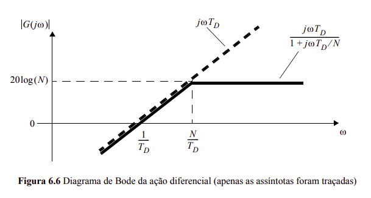

Fonte: [Apostila de Controle - Escola Politécnica da Universidade de São Paulo](https://edisciplinas.usp.br/mod/resource/view.php?id=123526)

### 3.3 Derivada do sinal medido versus derivada do erro

A derivada é uma operação matemática sensível a funções com descontinuidades. 
Considerando-se que o sinal de referência para controladores costuma ser contínuo por partes, isso implica em pontos de derivada tentendo ao infinito nos pontos de descontinuidade da função de referência. E o erro é calculado em função do sinal de referência como $e(t) = r(t) - y(t)$. Ou seja, o erro normalmente é uma função contínua por partes de tal maneira que $\cfrac{de(t)}{dt}$ tente ao infinito nos pontos de descontinuidade do erro. Para evitar que a parecela derivativa introduza eforços de controle tendendo ao infinito utiliza-se a derivada do sinal controlado $y(t)$ no lugar da derivada do erro.

Assim, o esforço de controle da parcela derivativa é implementado de maneira realista como

$u_{derivativa} = \text{filtro}(\cfrac{dy(t)}{dt})$

## 4 Exemplo de implementação na forma de sistema embarcado!

Como controlaremos as coordenadas x,y,z precisaremos de três controles PID operando conjuntamente (desprezaremos o controle de rotação do drone).
Logo será nescessário a criação de uma classe de controle que possa ser instânciada multiplas vezes.
Em python, uma forma de implementar isso é:

```python
class Control:
    def __init__(self):    
        self.e = 0
        self.e_i = 0
        self.un_1 = 0
        self.uIn_1 = 0
        self.uDn_1 = 0
        self.yn_1 = 0
        self.uP = 0
        self.uIn = 0
        self.uDn = 0
        self.un = 0

    def pid(self,r,yn,Kp,Ti,Td,N,sat,Ts):

        self.e = r - yn
        #anti-windup
        if (self.un_1 > sat or self.un_1 < - sat):
            self.e_i = 0
        else:
            self.e_i = self.e
        #pid
        self.uP = Kp*self.e
        self.uIn = self.uIn_1 + (Kp*Ts/Ti)*self.e_i #backward
        self.uDn = Td/(Td + N*Ts)*self.uDn_1 - (Kp*N*Td)/(Td+N*Ts)*(yn-self.yn_1)
        self.un = self.uP + self.uIn + self.uDn
        #update past values variables
        self.un_1 = self.un
        self.uIn_1 = self.uIn
        self.uDn_1 = self.uDn
        self.yn_1 = yn
        #return
        return self.un
```

O esquema de simulação adotado é mostrado a seguir

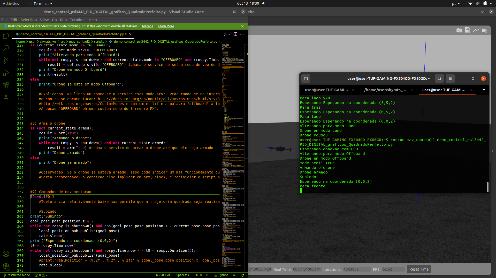

## 5 Ajustes de controles PID e resultados

A seguir são mostradas diferentes sinotnias de controle PID e seus efeitos na trajetória e no controle das coordenadas. A trajetória desejada é um quadrado.
O drone percorre as arestas do quadrado segundo as seguintes coordenadas. Note que z é a altura do drone.

* (x,y,z)
* (0,0,2)
* (5,0,2)
* (5,5,2)
* (0,5,2)
* (0,0,2)

A sintonia proposta é
```python
Kp=0.4
Ti= 300.0
Td = 1.1 
sat = 4
Ts = 1/40
N=10
```

No terminal a execução do node de controle resulta em:
```
user@user:~$ rosrun mav_control2 demo_control_psi3442_PID_DIGITAL_graficos_QuadradoPerfeito.py 
Esperando conexao com FCU
Alterando para modo Offboard
Drone em modo Offboard
mode_sent: True
Armando o drone
Drone armado
Subindo
Esperando na coordenada (0,0,2)
Para frente
Esperando Esperando na coordenada (5,0,2)
Para lado y>0
Esperando Esperando na coordenada (5,5,2)
Para tras
Esperando Esperando na coordenada (0,5,2)
Para lado
Esperando Esperando na coordenada (0,0,2)
Alterando para modo Land
Drone em modo Land
```

### 5.1 Interrupção do loop de controle
A implementação do método de controle pid é feito da seguinte maneira
```python
#Controle
while r-y > TOL
    u = pid(r,y,Kp,Ti,Td,N,sat,Ts)
    y = get_sensor()
#parada
while t<tmax
    drone.stay(r)
```

Em que o método pid() implementa o controle PID, get_sensor() obtem a informação do sensor da variavel controlada $y$ e o método drone.stay(r) implementa um controle para manter o drone na poisção desejada $r$.

O laço "controle" leva o drone da posição atual até a posição desjada $r$ com uma tolerância TOL, ou seja, leva o drone para um circulo de raio TOL e centro $r$.

O laço "parada" realiza um controle de tal maneira a manter o drone no circulo de raio TOL, permitindo que no intervalo de tempo tmax o erro seja minimizado caso seja não nulo durante essa etapa. Para que esse método funcione, é nescessáiro que o tempo tmax seja suficientemente grande para possibilitar o drone parar o seu movimento pois no momento que o drone entra na circunferência o erro e(t)=TOL e por tanto sua velocidade é não nula.

Se TOL é pequena, como deve ser, e tmax é insuficiente, é possível que seja observado "undershoot" como se vê a seguir. 

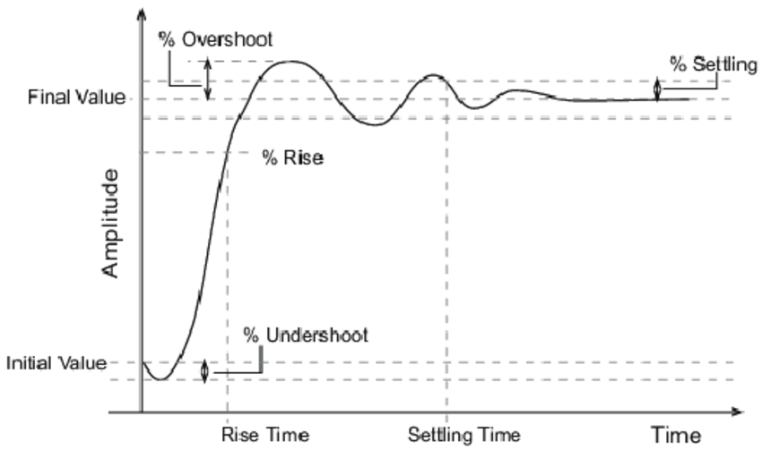

Do ponto de vista de controle, é como se essa configuração de TOL e tmax resultassem num sistema com zero real de fase não mínima, o que é ruim para controle. Sendo assim, um ajuste adequado desses parâmetros é essencial.

Referencia sobre sistemas com zeros reais de fase não mínima:
Stewart, J., & Davison, D. E. (2006). On Overshoot and Nonminimum Phase Zeros. IEEE Transactions on Automatic Control, 51(8), 1378–1382. doi:10.1109/tac.2006.878745


### 5.2 Controle P
A trajetória no plano XY:

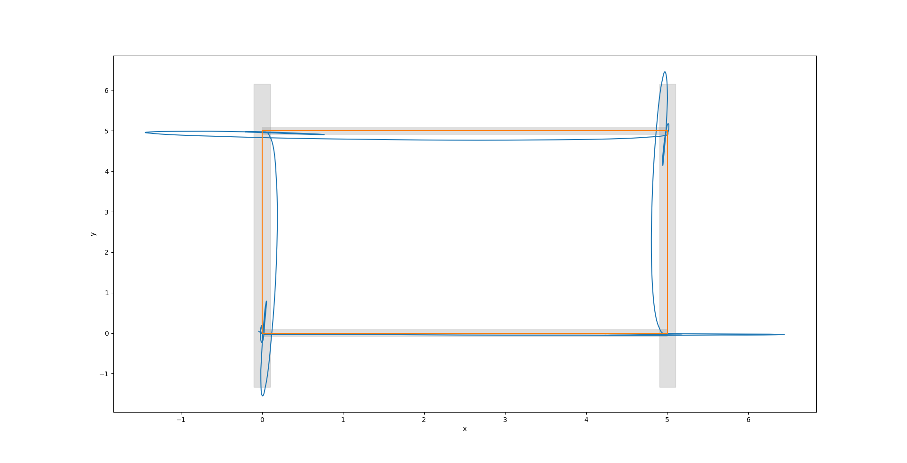

A evolução temporal das variáveis controladas:

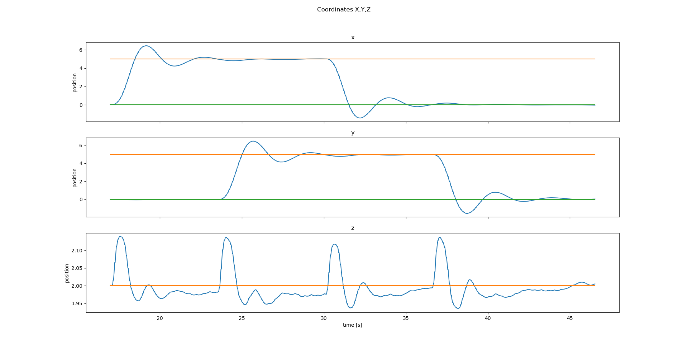

Conclusão: rastreou a trajetória quadrada. Porém, a tolerância de 0.1m (em cinza) foi desrespeitada. Isso ocorre pois o ganho $ Kp $ utilizado é muito alto o que implica em sobressinal. O tempo total foi de 46s.

### 5.3 Controle PI

A trajetória no plano XY:

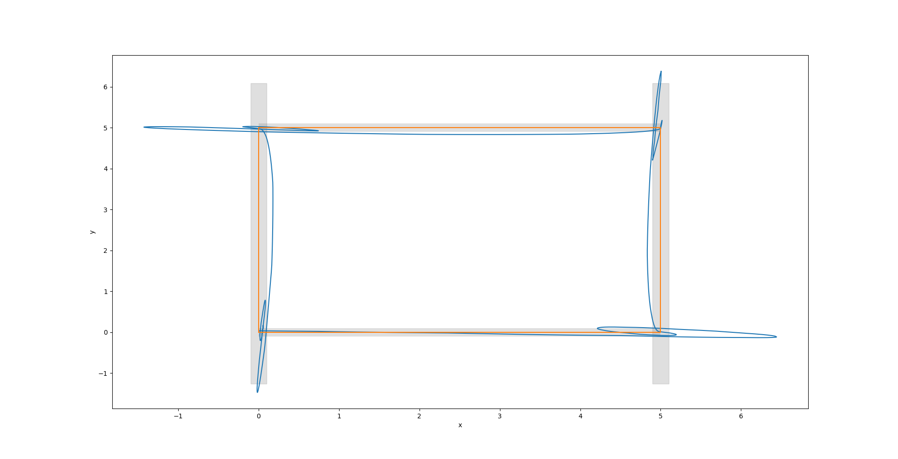

A evolução temporal das variáveis controladas:

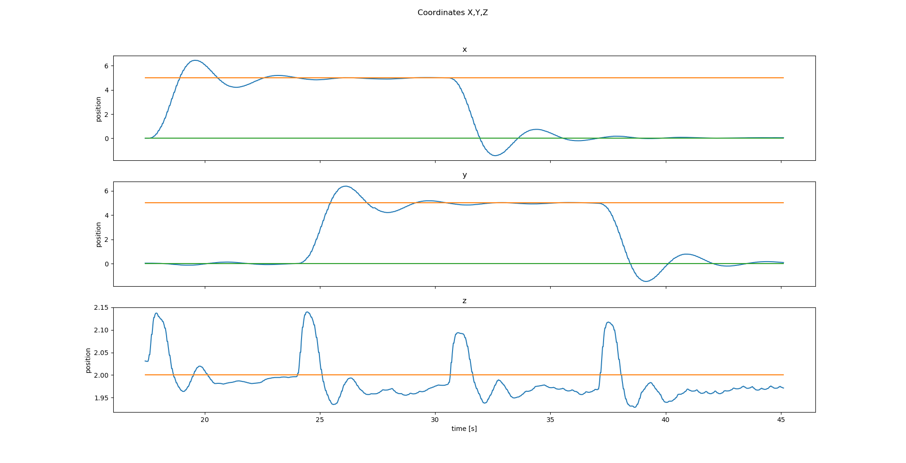

Conclusão: rastreou a trajetória quadrada. Porém, a tolerância de 0.1m (em cinza) foi desrespeitada. Isso ocorre pois o ganho $ Kp $ utilizado é muito alto e o integrador potencializa a agressividade do controle o que implica em sobressinal. O tempo total foi de 45s. Considerando-se a similaridade dos gráficos do controle P e PI fica implicito que a sintonia de $ T_i $ é suave, isto é, o controle tem pouco ganho integral.

### 5.4 Controle PD 

A trajetória no plano XY:


A evolução temporal das variáveis controladas:

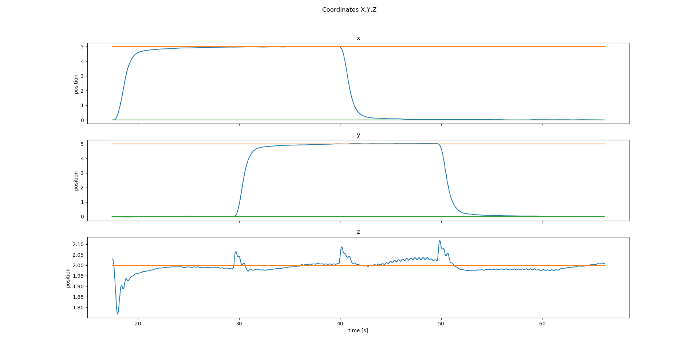

Conclusão: rastreou a trajetória quadrada respeitando a tolerância de 0.1m (em cinza). Não se observa sobressinal pois a parcela derivativa "prevê" que isso irá ocorre e introduz de maneira antecipada um ganho tal que o sobressinal seja eliminado. Nesse caso, o trade-off a ser considerando é que o sistema melhorou no quesito precisão do rastreamento, mas tornou-se muito mais lento. Com um tempo total de 66s houve um incremento de aproximadamente 47% dessa grandeza em relação ao controle P ou PI.

### 5.5 Controle PID

A trajetória no plano XY:

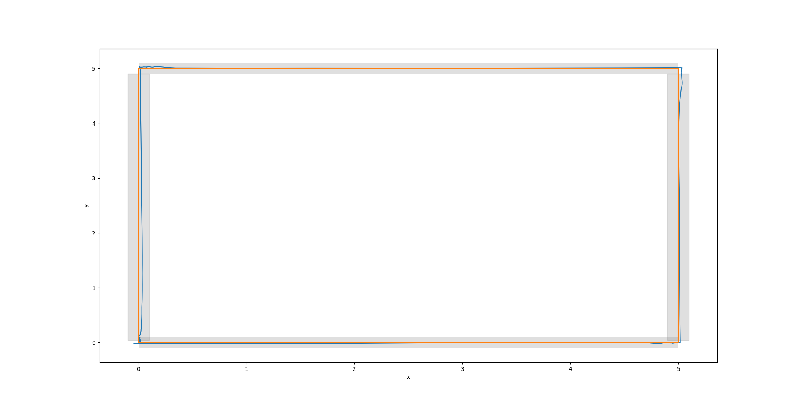

A evolução temporal das variáveis controladas:

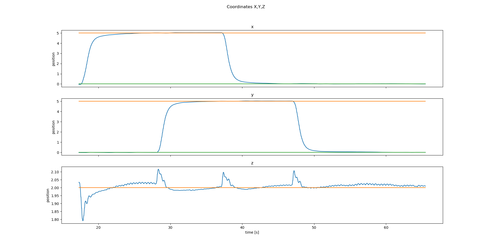

Conclusão: rastreou a trajetória quadrada respeitando a tolerância de 0.1m (em cinza). Não se observa sobressinal devido a parcela derivativa e não houve mudança relativa em relação significativa em relação ao controle PD dado que a parcela integral adotada não é agressiva.


### 5.6 Regime Subamortecido

Sistemas com overshoot são em geral mais rápidos em $t_r$ (rise time) e $t_s$ (settling time) se comparado aos regimes crítico e supercrítico. Porém, em certas aplicações a presença de overshoot é inadimissível. Considerando-se o estado da arte em drones em que se está considerando o acoplamento de ferramentas ao drone, sobressinal em trajetórias de drone se tornará inadimissível nesse cenáiro.

### 5.7 Regime Critico

Esse regime é um caso limite entre o subamortecido e o supercrítico. Suas características principais são não apresentar overshoot e ser o mais rápido dentre os sistemas supercríticos. Aqui não é mostradada nenhuma simulação desse regime pois por se tratar de regime muito particular, seria nescessário conhecer um mode fiel do drone para que um ajuste fosse feito de modo a alcançar esse regime. Somente pela observação dos gráficos é difícil afirmar que um sisemas está operando em regime crítico.

### 5.8 Regime Supercritico

O comporatamento de um sistema nesse regime é mostrado nos gráficos referentes ao controle PD. Não há sobressinal e o tempo de acomodação $t_s$ é grande.

### 5.9 Flexibilizando precisão, controle rápido

Flexibilizando-se a precisão da trajetória em troca de uma diminuição de 21% do tempo total de execução da trajetória respeitando ainda a tolerância TOL imposta tem-se o seguinte controle.

A trajetória no plano XY:

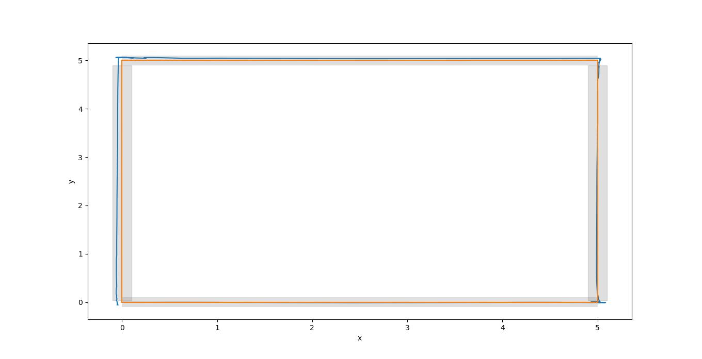

A evolução temporal das variáveis controladas:


Observação: o resulatado na coordenada z poderia ser melhor caso se adotasse uma sintonia mais suave para o controle dessa coordenada.

## 6 Breve discussão sobre identificação de sistemas

Para se alcançar boas sintonias de controladores é recomendado que se utilize uma técnica baseada em modelo ou o ajuste de um controle sem modelo como o PID utilizando-se um modelo matemático de modo a especificar características de reposta temporal (maximum peak, rise time, settling time) e de resposta em frequência.

Existem diversasa maneiras de se obter um modelo. Pode-se derivar um modelo via abordagem fenomenológica ou por relações entrada-saída. Por simplicidade serão ilustrados a seguir métodos de Identificação de Sistemas (relações entrada-saída) para auxiliar no projeto de controladores PID.

### 6.1 Sundaresan Krishnaswamy


O modelo da planta é

$G(s) = \cfrac{Kp e^{-\theta s}}{\tau s + 1}$

com

$\theta = 1.294t_{0.353} - 0.294t_{0.853}$

$\tau = t_{0.853} - t_{0.353}$

$Kp = y_{\infty} - y_0$

medidos sob excitação de degrau unitário.

### 6.2 Exemplo de identificação de sistemas

Suponha que se queria controlar a posição de um drone eviando comandos de velocidade com um controle C no tópico 
```
'/mavros/setpoint_velocity/cmd_vel'
```
da mavros da simulação do px4 com o drone Iris no gazebo. 

Mandamos o comando velocidade_x = 1, que é equivalente a uma excitação de degrau unitáiro.

E observamos o comportamento dinâmico do sistema até que a velocidade do drone na coordenada x seja unitária. Observa-se o gráfico da dinâmica identificada a seguir:

E com base no método de Sundaresan Krishnaswamy levantamos o modelo:

$t_{0.353} = 0.4$ s

$t_{0.853} = 1.4$ s

$\theta = 1.294t_{0.353} - 0.294t_{0.853} = 0.106$

$\tau = t_{0.853} - t_{0.353} = 1$

$Kp = y_{\infty} - y_0 = 1$

Então o modelo da planta é

$G(s) = \cfrac{1 e^{-0.106 s}}{1s + 1} \approx \cfrac{1}{s + 1}$

E essa aproximação é razoável pois o atraso de transporte $\theta$ é aproximadamente 10 vezes menor que a constante de tempo $\tau$ do sistema.

### 6.3 Exemplo de controle baseado em modelo

Como o modelo obtido projetamos uma lei de controle seguindo as seguintes especificações:

* Máximo sobressinal: Mp=3%
* Tempo de acomodação (Settling Time): ts=10s

Que significa um bom compromisso em baixo Mp e um tempo rápido de rastreio da trajetória de referência.

Sabemos que 

$\xi = \cfrac{-\text{ln}(Mp/100)}{\sqrt{(\pi^2 + log(Mp/100)^2)}}$

$\omega_n = \cfrac{4}{\xi t_s} 

Modelando o segurador de ordem zero como:

$ZOH(s) = \cfrac{1 - e^{-sT_s}}{s} \approx \crfac{b}{s + b} \ , \ b = \cfrac{2}{T_s}$

As especificações temporais (Mp,ts) implicaram nas especificações ($\xi$,$\omega_n$) que por sua vez implica na seguinte função de transferência de malha fechada cuja resposta apresenta exatamente as especificações desejadas. 

$Projeto(s) = \cfrac{\omega_n^2}{s^2 + 2s\xi\omega_n + \omega_n^2}$

Considere o controle (a função proposta fará sentido a seguir no cálculo da FTMA)

$C(s) = \cfrac{k(s+zc)}{s+pc}$

A função de transferência de malha aberta será

$FTMA(s) = G(s)* C(s) * ZOH(s) \approx \cfrac{1}{s + 1} \cfrac{k(s+zc)}{s+pc} \cfrac{b}{s + b}$

De onde a escolha zc = 1 (polo estável da planta) implica em 

$FTMA(s) =  \cfrac{k}{s+pc} \cfrac{b}{s + b}$

E a função de transferência de malha fechada será

$FTMF(s) = \cfrac{kb}{s^3 + s^2(b + p_c) + s p_c b + kb}$

Porém, nossa função de transferência de malha fechada tem polinômio característico de ordem 2. Para que seja de ordem 3, considere um polo "p" muito rápido. A nova função de transferência de malha fechada de projeto é

$ProjetoCubico(s)= \cfrac{p\omega_n^2}{(s^2 + 2s\xi\omega_n + \omega_n^2)(s+p)}$

E portanto $FTMF(s)=ProjetoCubico(s)$

O que leva ao seguinte sistema de equações


Cuja resolução resulta em (pc,p,k) de tal modo que se p<p_ideal onde p_ideal é a parte real do polo mais rápido de $Projeto(s)$.

Os polos de $Projeto(s)$ são (p1=-0.4000 + 0.3584i) e (p2 = -0.4000 - 0.3584i) e (p = -80.0036).
Logo $\cfrac{{\rm I\!R}(p)}{{\rm I\!R}(p1) = \cfrac{80}{0.4} = 200 > 10}$ e assim as premissas de projeto são válidas.


$C(s) = \cfrac{k(s+zc)}{s+pc} = \cfrac{0.28844 (s+0.9753)}{(s+0.8036)}$

Transformando a função de transferência do controlador por Tustin tem-se:

$C(z) = \cfrac{0.28905(z-0.9759)}{(z-0.9801)}$

E antitransformando para o domínio temporal discreto a lei de controle projetada é

```
un = -0.98011*un_1 +0.28844*en +0.28149*en_1
```

Esse projeto pode ser realizado utilizando o [código matlab ](https://github.com/SkyRats/psi3442/blob/master/3a_Aula/Aprofundamento/Projeto_SISO_baseado_em_modelo/controle_baseado_modelo.m)

#### 6.3.1 Resultados Matlab


#### 6.3.2 Resultados Gazebo com python

A classe de controle reimplementada contendo o controle baseada em modelo é:

```

```

A trajetória alcançada é mostrada a seguir


E a evolução temporal das variáveis (x,y,z) é mostrada a seguir


## 7 Aplicação: Solução do exercício proposto na aula 3

Uma proposta de solução é mostrada [aqui](https://github.com/SkyRats/psi3442/blob/master/3a_Aula/Aprofundamento/ControleQuadradoPerfeito/demo_control_psi3442_PID_DIGITAL_graficos_QuadradoPerfeito.py)
