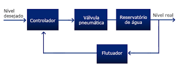

# Aprofundamento em sistemas cyberfísicos

Nesta atividade, iremos explorar aspectos de controle de sistemas dinâmicos, implementação realista de controle PID e a solução do exercício proposto na aula 3.

## 1. Introdução ao controle de sistemas dinâmicos
### 1.1 O significado de controlar e nomeclatura
### 1.2 Malha de Controle de sistemas SISO

 1a)
 1b)
 1c)

fonte das imagens: [PUC-RIO](https://www.maxwell.vrac.puc-rio.br/24097/elementos.html)

Na figura 1a) Se observa um esquema de controle do nível de um reservatório de água. Existe um Suprimento de água que é controlado por uma vávula de controle. Quando falta água, a válvula se abre permitindo repor a água para manter um nível desejado no reservatório. O nível desejado é medido por um sensor de nível que fornece essa informação a um controlador de nível que por sua vez regula a válvula.

Na figura 1b) O mesmo se observa, mas os elementos físicos são abstratídos em um **diagrama de blocos** que por sua vez chega em seu nível de abstração máxima quando retratado por funções de transferência **C(s), G(s)** e **L(s)** com sinais no domínio de laplace **L(s)**.

## 2. O controle PID
### 2.1 Proporcional
### 2.2 Integral
### 2.3 Derivativo
## 3. Implementação realista do controle PID
### 3.1 Anti-windup
### 3.2 Filtro de derivada
### 3.3 Exemplo de implementação!
## 4. Aplicação: Solução do exercício proposto na aula 3.

