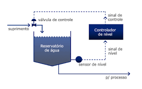

# Aprofundamento em sistemas cyberfísicos

Nesta atividade, iremos explorar aspectos de controle de sistemas dinâmicos, implementação realista de controle PID e a solução do exercício proposto na aula 3.

Nesse texto, os tópicos são introduzidos de maniera breve e direta sendo recomendado ao leitor ou leitora uma leitura mais aprofundada na referência: Controle Automático (Castrucci) -  2 Edição.

## 1. Introdução ao controle de sistemas dinâmicos
### 1.1 O significado de controlar e nomeclatura

A ideia de controle automático é muito antiga, mas popularmente considera-se o regulador de Watt como sendo o primeiro controlador automático da humanidade.

A ideia de controlar consiste em condicionar uma variável de interesse a um valor especificado. Por exemplo, manter o nível de uma piscina em 2.5m de altura ou comandar um drone para que saia de um ponto origem **A** e chege a um ponto destino **B**.

Os primeiros controles, antes do regulador de Watt implementavam ''sistema de malha aberta'' em que para controlar a temperatura de um forno, uma embalagem de Lasanha recomenda que se pré-aqueça um forno por 15 min sem que se meça a temperatura do forno para se saber se de fato a temperatura encontra-se no patamar desejado.

Depois, surgiram os controladores em ''malha fechada'' em que uma medida daquilo que se desejava controlar era repassada para um controlador realizar um esforço de controle com base no erro entre o valor desejado e o valor medido da variável que se deseja controlar. Um exemplo clássico desse sistema é quando alguém desjea tomar um banho quente, mas a água está muito fria e percebendo o erro entre a temperatura desejada da água e a temperatura gélida daquele instante a pessoa fecha um pouco o registro para que a diminuição da vazão implique em uma água mais quente para o banho.

Essa ideia de realimentação do sinal medido, comparação com uma referência que resultasse num erro que por sua vez resultasse numa ação de controle deu origem ao que se chama de ''Malha de controle'' que será mostrada a seguir.

### 1.2 Malha de Controle de sistemas SISO

 1a)
 1b)
 1c)

fonte das imagens: [PUC-RIO](https://www.maxwell.vrac.puc-rio.br/24097/elementos.html)

Na figura 1a) Se observa um esquema de controle do nível de um reservatório de água. Existe um Suprimento de água que é controlado por uma vávula de controle. Quando falta água, a válvula se abre permitindo repor a água para manter um nível desejado no reservatório. O nível desejado é medido por um sensor de nível que fornece essa informação a um controlador de nível que por sua vez regula a válvula.

Na figura 1b) O mesmo se observa, mas os elementos físicos são abstratídos em um **diagrama de blocos** que por sua vez chega em seu nível de abstração máxima quando retratado por funções de transferência **C(s)** representando o controlador, **G(s)** represenatdndo a dinâmica da planta (reservatório) e **L(s)** representando a dinâmica do sensor de nível. E com sinais no domínio de laplace **R(s)** sendo a referência de nível desejada, **E(s)** o erro entre o nível desejado e o nível atual (note que é realizada uma operação de comparação entre R(s) e o sinal que sai de L(s) comumente denominado B(s)), e **Y(s)** sendo o sinal medido que se deseja controlar. O sinal que sai do bloco C(s) e direciona-se a controlar o bloco G(s) é comumente denominado U(s) e é chamado esforço de controle.

Dado essa maneira de pensar um controlador, o algorítimo de controle **C(s)**  mais utilizados em sistemas SISO *Single Input - Single Output* é o PID *Proporcional Integral e Derivaitivo* que funciona por meio das operações de proporcionalidade, integral e derivada do erro entre o que se tem de referência para uma dada variável e seu valor real em um determinado instante. A seguir, explora-se as características e implementações desse algorítimo.

## 2. O controle PID
### 2.1 Proporcional
### 2.2 Integral
### 2.3 Derivativo
## 3. Implementação realista do controle PID
### 3.1 Anti-windup
### 3.2 Filtro de derivada
### 3.3 Derivada do sinal medido versus derivada do erro
### 3.3 Exemplo de implementação!
## 4. Aplicação: Solução do exercício proposto na aula 3.

